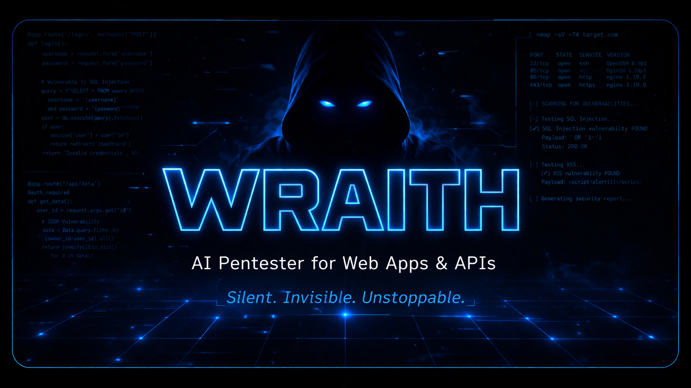

<p align="center">
  
</p>

# WRAITH: Autonomous AI Penetration Testing Agent

**WRAITH** is a fully local, autonomous AI-powered penetration testing agent. It leverages the reasoning capabilities of local Large Language Models (like `qwen3.5:9b` or `llama3`) to autonomously discover, plan, and execute sophisticated attacks against web targets, using a high-speed Go-based engine.

---

## ⚡ Features

- **100% Local Execution**: WRAITH requires no cloud APIs. Your target data and vulnerabilities never leave your machine.
- **Decoupled Architecture**: 
  - **The Brain (Python)**: An AI orchestrator that maintains state, builds context, formulates attacks, and manages the test lifecycle.
  - **The Muscle (Go)**: A high-performance gRPC server that executes HTTP requests, crawls targets, and fingerprints technologies instantly.
- **Live Terminal Dashboard**: A stunning, split-screen UI built with `rich` that displays real-time AI reasoning, task progression, and discovered vulnerabilities.
- **Automated Reporting**: All findings are persisted in a local SQLite database and can be instantly exported into beautiful, hacker-aesthetic HTML reports.

---

## 🛠️ Prerequisites

WRAITH is distributed as a set of Docker containers via the GitHub Container Registry. To run WRAITH, you will need:
- **Docker & Docker Compose** installed on your machine.
- **Ollama** installed and running on your host machine to serve the local AI models.

---

## 🚀 Quick Start

The easiest way to run WRAITH is using the pre-built Docker images (`ghcr.io/vectorcipher/wraith-scanner` and `wraith-agent`).

1. **Clone the repository:**
   ```bash
   git clone https://github.com/vectorcipher/Wraith.git
   cd Wraith
   ```

2. **Pull the AI Model:**
   Ensure Ollama is running (`ollama serve`) on your host machine, then pull the default model:
   ```bash
   ollama pull qwen3.5:9b
   ```

---

## 🎯 Usage

Running WRAITH is incredibly simple using Docker Compose.

### 1. Start the Go Scanner Engine
Open a terminal in the `Wraith` directory and start the high-speed gRPC engine in the background:
```bash
docker-compose up -d scanner
```

### 2. Launch an Autonomous Scan
Launch the Python AI agent against your target URL. The agent will boot up, connect to your local Ollama instance, and begin orchestrating the attack via the scanner container.
```bash
docker-compose run --rm agent scan http://example.com
```

WRAITH will now initialize, fingerprint the target, crawl for endpoints, formulate an attack strategy, and begin executing payloads!

### 3. Generate the Pentest Report
Once a scan completes (or is aborted), WRAITH saves all confirmed vulnerabilities to the local database. You can generate an HTML report using the unique `scan_id`:
```bash
docker-compose run --rm agent report <scan_id>
```
Reports and databases are automatically mapped to your host file system in the `./reports/` and `./data/` directories, so they are not lost when the container stops.

---

## 🧪 Testing against a Mock Target

WRAITH includes a purposely vulnerable lightweight Python API for testing purposes. To run an end-to-end test safely:

1. **Start the vulnerable target locally (requires Python):**
   ```bash
   python tests/target_app.py
   ```
2. **Launch the agent against the host machine:**
   Because Docker runs in its own network, use `host.docker.internal` to attack the mock app running on your host machine!
   ```bash
   docker-compose run --rm agent scan http://host.docker.internal:5000
   ```

---

## ⚠️ Disclaimer

WRAITH is designed exclusively for authorized penetration testing, security research, and educational purposes. **Do not use WRAITH against targets without explicit, written permission from the owner.** The developers assume no liability for misuse.
