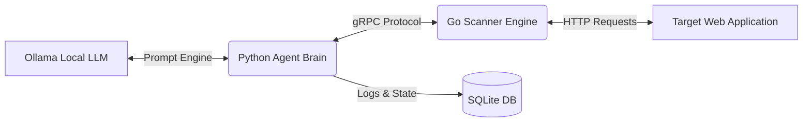

# WRAITH: Autonomous AI Penetration Testing Agent


**WRAITH** is a fully local, autonomous AI-powered penetration testing agent. It leverages the reasoning capabilities of local Large Language Models (like `qwen3.5:9b`) to autonomously discover, plan, and execute sophisticated attacks against web targets, using a high-speed Go-based engine.

---

## ⚡ Features

- **100% Local Execution**: WRAITH requires no cloud APIs. Your target data and vulnerabilities never leave your machine.
- **Decoupled Architecture**: 
  - **The Brain (Python)**: An AI orchestrator that maintains state, builds context, formulates attacks, and manages the test lifecycle.
  - **The Muscle (Go)**: A high-performance gRPC server that executes HTTP requests, crawls targets, and fingerprints technologies instantly.
- **Live Terminal Dashboard**: A stunning, split-screen UI built with `rich` that displays real-time AI reasoning, task progression, and discovered vulnerabilities.
- **Automated Reporting**: All findings are persisted in a local SQLite database and can be instantly exported into beautiful, hacker-aesthetic HTML reports.

---

## 🏗️ Architecture



## 🛠️ Prerequisites

To run WRAITH locally, you will need:
- **Python 3.11+**
- **Go 1.21+**
- **Ollama** installed and running on your machine.

---

## 🚀 Installation

1. **Clone the repository:**
   ```bash
   git clone https://github.com/YourUsername/Wraith.git
   cd Wraith
   ```

2. **Setup the Python Environment (The Agent):**
   ```bash
   python -m venv .venv
   source .venv/bin/activate  # On Windows: .\.Venv\Scripts\activate
   pip install -r agent/requirements.txt
   ```

3. **Pull the AI Model:**
   Ensure Ollama is running (`ollama serve`), then pull the default model:
   ```bash
   ollama pull qwen3.5:9b
   ```

---

## 🎯 Usage

Running WRAITH requires starting both the Go Scanner and the Python Agent.

### 1. Start the Go Scanner
Open a terminal and start the high-speed gRPC engine:
```bash
cd scanner
go run ./cmd/scanner/main.go
```
*(The scanner will run on `localhost:50051` by default)*

### 2. Launch an Autonomous Scan
In a new terminal (with your Python environment activated), start the WRAITH orchestrator:
```bash
cd agent
python wraith.py scan http://localhost:5000
```
WRAITH will now initialize, fingerprint the target, crawl for endpoints, formulate an attack strategy, and begin executing payloads. 

### 3. Generate the Pentest Report
Once a scan completes (or is aborted), WRAITH saves all confirmed vulnerabilities to the local database. You can generate an HTML report using the unique `scan_id`:
```bash
cd agent
python wraith.py report <scan_id>
```
Reports are automatically saved to `~/.wraith/reports/`.

---

## 🧪 Testing against a Mock Target

WRAITH includes a purposely vulnerable lightweight Python API for testing purposes. To run an end-to-end test safely:

1. **Start the vulnerable target:**
   ```bash
   python tests/target_app.py
   ```
2. Start the Go Scanner and run `wraith.py scan http://localhost:5000` as described above.

---

## ⚠️ Disclaimer

WRAITH is designed exclusively for authorized penetration testing, security research, and educational purposes. **Do not use WRAITH against targets without explicit, written permission from the owner.** The developers assume no liability for misuse.
